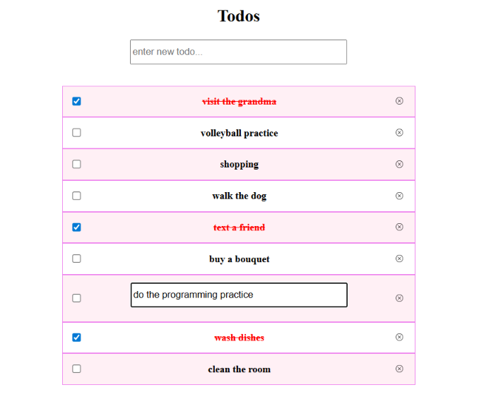

# 📝 TodosExample — React Todo List Application

A web application for daily task planning built with the React library. The project demonstrates modern development practices using functional components and advanced state management techniques.

👉 **[Live Demo Application](https://OlehKuts.github.io./todosExample)**

---

## 📷 Application Interface



---

## ✨ Features

- **Task Management:** Add new tasks, edit existing entries, and delete completed items.
- **Data Persistence:** Complete synchronization with the browser's `LocalStorage` (tasks remain saved after refreshing the page).
- **Unique Identifiers:** Automatic generation of unique keys for each task item.

---

## 🛠️ Tech Stack

- **Core Library:** React (Functional Components)
- **State Management:**
  - `useReducer` — manages complex state logic predictably.
  - `Context API` — prevents prop drilling and passes data deeply down the component tree.
  - **Custom Hooks** — encapsulates and shares reusable data fetching and state logic.
- **Utilities:** `uuid` (unique ID generation for list elements).
- **Deployment:** GitHub Pages.

---

## 🚀 Local Installation and Setup

Follow these steps to run the project locally on your machine:

1. **Clone the repository:**

   ```bash
   git clone github.com
   ```

2. **Navigate to the project directory:**

   ```bash
   cd todosExample
   ```

3. **Install dependencies:**

   ```bash
   npm install
   ```

4. **Start the local development server:**
   ```bash
   npm start
   ```
   _The application will automatically open in your browser at [http://localhost:3000](http://localhost:3000)._

---

## 👤 Author

_Developed by [Oleh Kuts](https://github.com/OlehKuts)_
